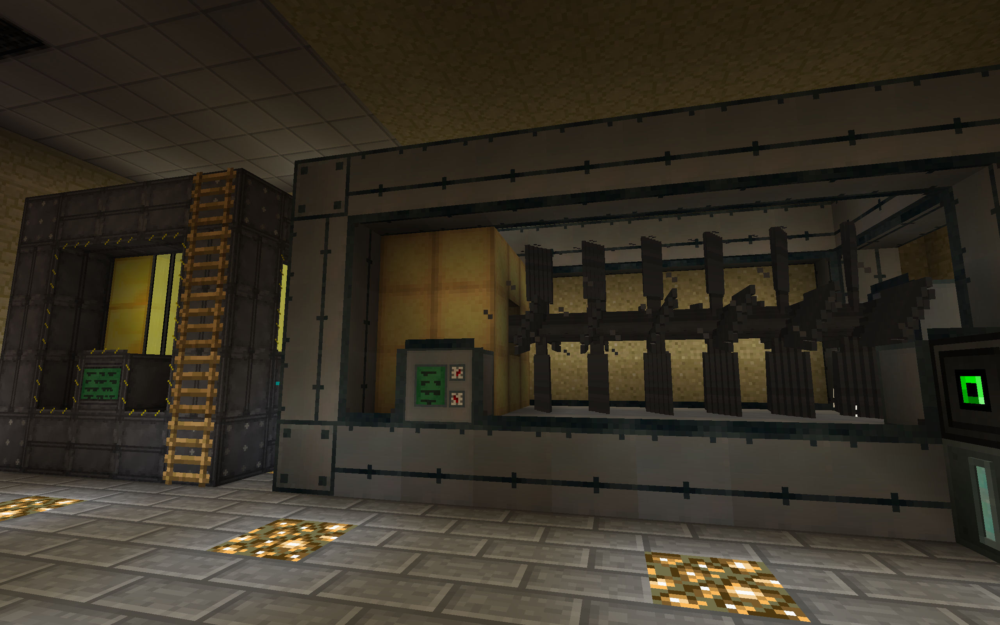
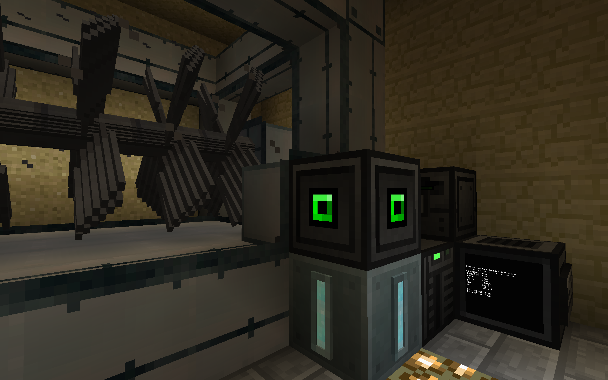
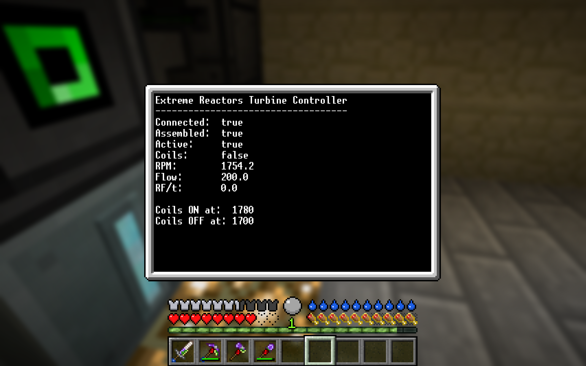
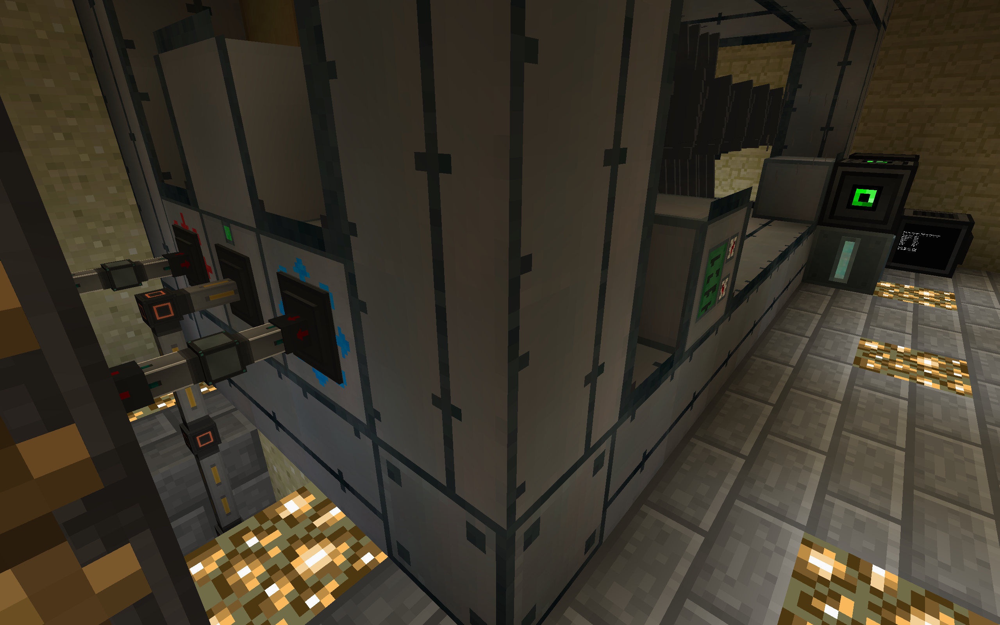

OpenComputers Extreme Reactors Turbine Controller

Tested with:
Minecraft 1.10.2
Forever Stranded 2.0.9
Extreme Reactors 1.10.2-0.4.5.49
OpenComputers 1.7.5.245

This repository contains a setup guide and control program for running an
Extreme Reactors turbine using OpenComputers in the Forever Stranded modpack.

See the Lua file for full setup instructions.

### Reactor and Turbine Setup

### OpenComputers Setup

### Turbine Controller Display

### Reactor / Turbine Conduits

